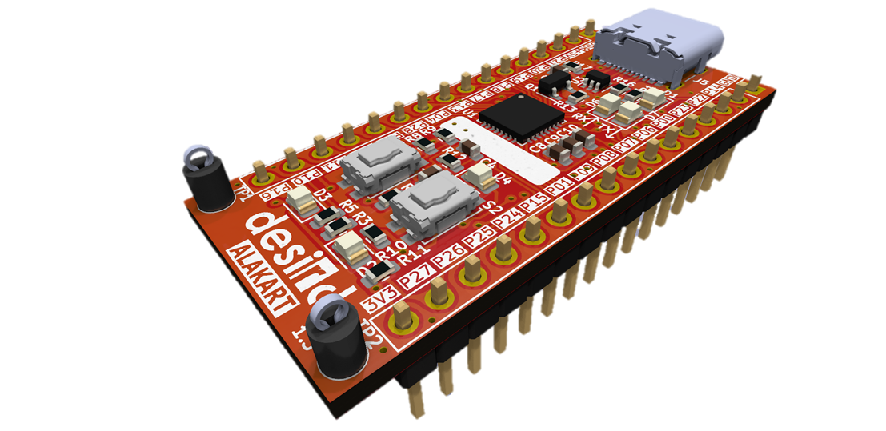
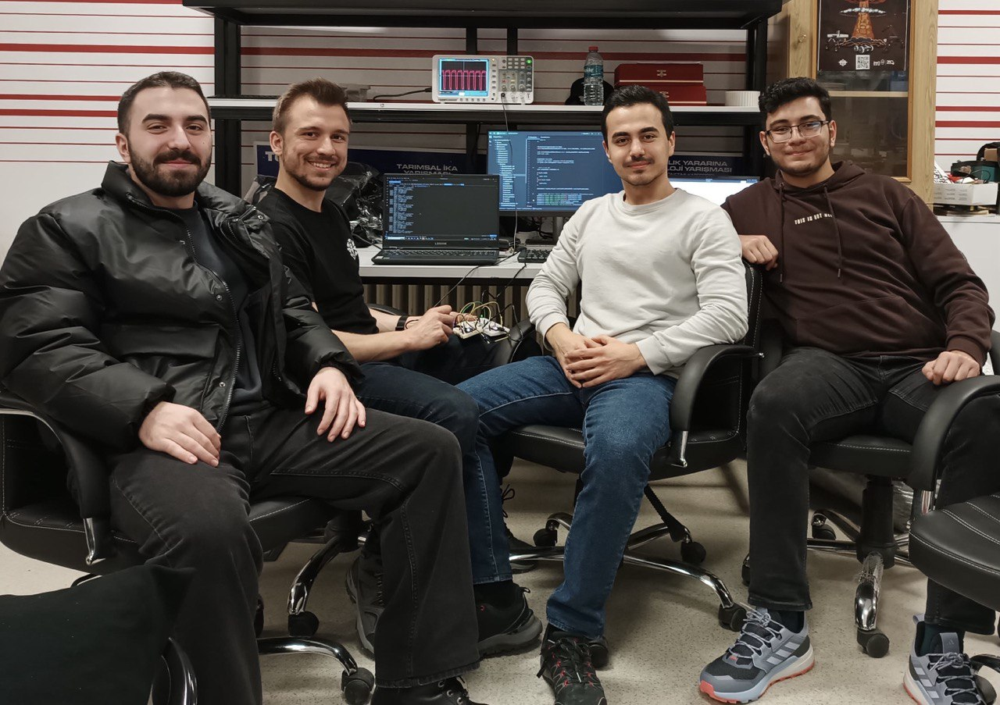

  

# KON-309E - Microcontroller Systems
This repository contains assignments and solutions for the KON-309E course in the 2023 fall term.
 

## Development Board

   
  
Alakart Development Board

 

In the KON-309E course, [**ALAKART**](https://desird.com/alakart/) development card is used. This card is produced by Desird Tasarım Ar.Ge A.Ş. **NXP LPC824** is used as the processor in this card. And it has the following features:
- ARM Cortex-M0+ based, low-cost 32-bit MCU family operating at CPU frequencies of up to 30 MHz
- 32 KB flash memory

## Experiments

- [**Experiment 1**](https://github.com/ismeterd/KON309E/tree/master/experiments/experiment-1)
- [**Experiment 2**](https://github.com/ismeterd/KON309E/tree/master/experiments/experiment-2)
- [**Experiment 3**](https://github.com/ismeterd/KON309E/tree/master/experiments/experiment-3)
- [**Experiment 4**](https://github.com/ismeterd/KON309E/tree/master/experiments/experiment-4)
- [**Experiment 5**](https://github.com/ismeterd/KON309E/tree/master/experiments/experiment-5)
- [**Final Experiment**](https://github.com/ismeterd/KON309E/tree/master/final_experiment)

## Tutorial Programs

- [**GPIO Example**](https://github.com/ismeterd/KON309E/tree/master/tutorial_programs/gpio_three_buttons_three_leds)
- [**PWM Example**](https://github.com/ismeterd/KON309E/tree/master/tutorial_programs/pwm_three_buttons_three_leds)
- [**MRT Example**](https://github.com/ismeterd/KON309E/tree/master/tutorial_programs/mrt_three_leds)
- [**PINT Interrupt Example**](https://github.com/ismeterd/KON309E/tree/master/tutorial_programs/pint_interrupt_three_leds)
- [**ADC Example**](https://github.com/ismeterd/KON309E/tree/master/tutorial_programs/adc_with_user_input)

## Team

   
  
Eren Şermet, Tahsin Ocaktan, İsmet Erdoğan, Oğuzhan Ölçekçi

